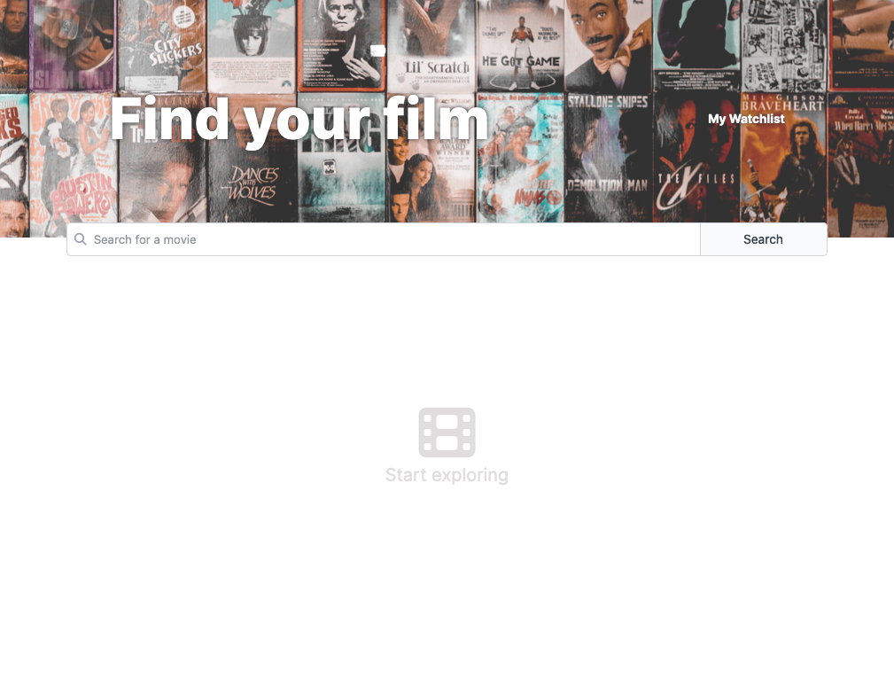
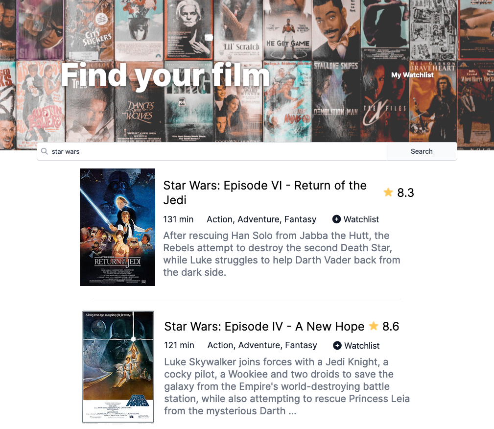
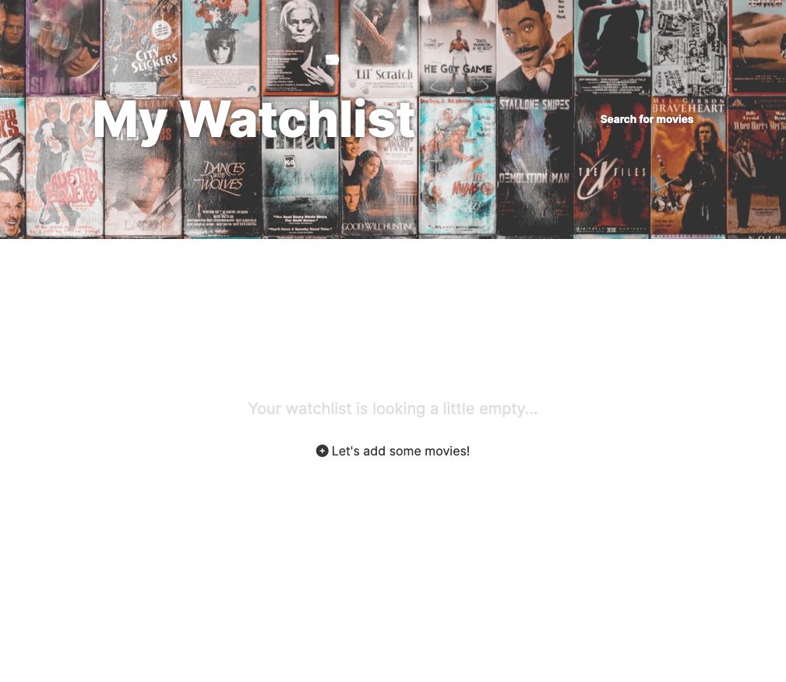
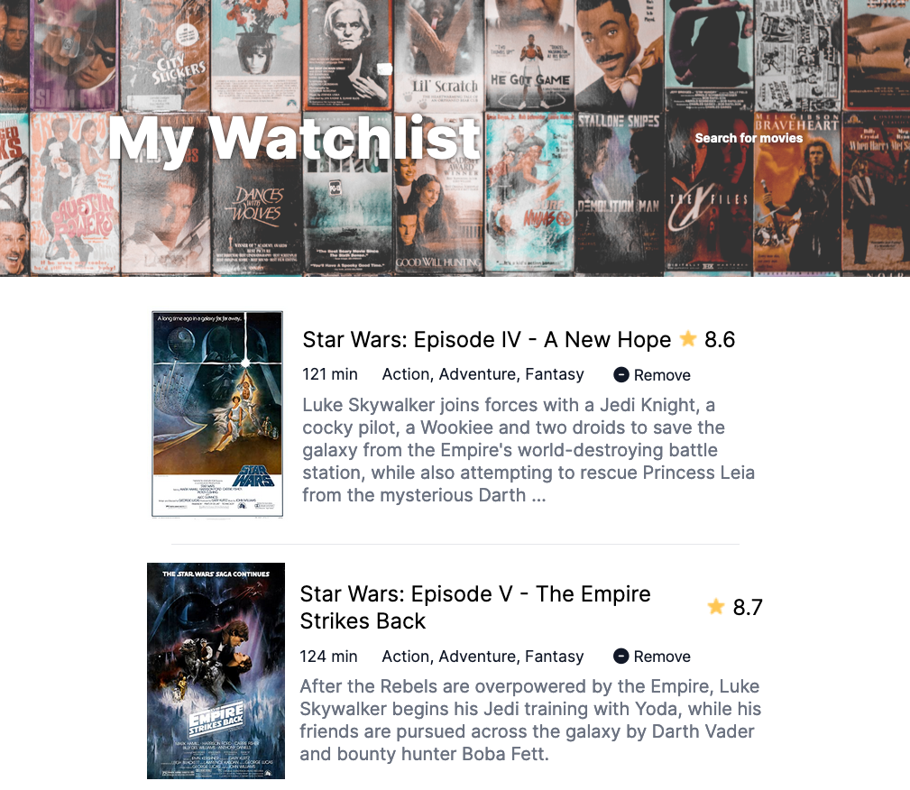

# Movie Watchlist

This is my solution to the solo project for [Module 9 of Scrimba.com's Frontend Career Path](https://scrimba.com/learn/frontend/).

## Contents 

- [Overview](#overview)
- [My Process](#my-process)
  - [Built with](#built-with)
- [Screenshots](#screenshots)
  - [Desktop](#desktop)
  - [Mobile](#mobile)
- [Status](#status)
- [Connect](#connect)

## Overivew

This solo project focuses on using REST API gather search results, based on user input, from the Open Movie Database. Then users have the ability to add those selected resutls to a movie wathclist which is displayed on another page on the site.

Requirements: 
- Two pages: index.html and watchlist.html
- Index is the search page
  - Makes call to OMBD API with the user-input search query and displays results 
- "add to watchlist" button which saves data to local storage
- watchlist.html laods and displays data from local storage 

Resources: 
- [Figma file](https://www.figma.com/file/jhFRdFIdHpRxsDznNXtpXw/Watchlist-Creator?node-id=2%3A17)
- [OMDB API](https://www.omdbapi.com/)

## My Process

For this project, I went back and forth between styling the pages and getting the REST API functionality to work properly. I started with getting the basic styles complete for the index.html and watchlist.html before adding styling for the search results and rendered watchlist. 

### Built with

- HTML
- CSS
- JavaScript

## Screenshots

![An animated GIF demonstrating the movie watchlist in action. The user navigates to the homepage which contains a header image of movie posters displayed in grid with the text “Find your film” and “My Watchlist”. Below the header is a search bar where the user inputs the text “star wars” and the results appear below the search bar. The results are displayed in a list with the movie poster on the left and information about the movie to the left. The user then clicks the “+ watchlist” button to add the film “Star Wars IV: A New Hope” to their watchlist. The user clicks the “My Watchlist” link in the upper right corner to navigate to the watchlist page where the added film is displayed. The user then clicks the “- remove” button to remove the film from the watch list. After removal, the following text is displayed, “Your watchlist is looking a little empty…” with a button underneath that says, “+ Let’s add some movies!”](movie-watchlist.gif)

## Status

I am currently working deploying the project in way that does not reveal the API key, however I have encountered some errors in the process. Please check back for updates.  

## Connect

Thank you for reading about this project. If you'd like to connect with me for mentoring, collaboration, or employment opportunities, you can do so via the following links:

- <a href="mailto:msg.for.anthony.p6ht3@simplelogin.com?subject=Nice GitHub Project&body=Hey Anthony, I saw your GitHub project. Let's talk!">Email</a>
- [LinkedIn](https://linkedin.com/in/anthonynanfito)
- [Portfolio](https://ananfito.github.io)
- [Blog](https://ananfito.hashnode.dev)
